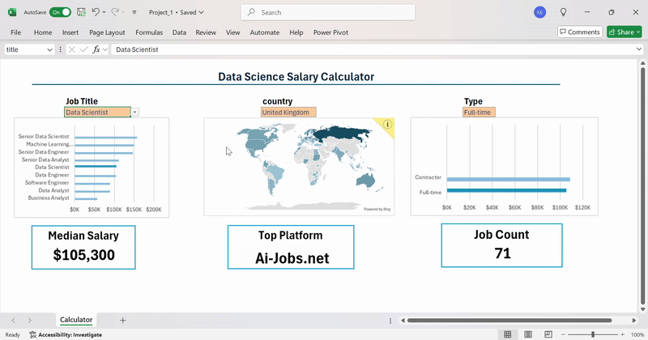
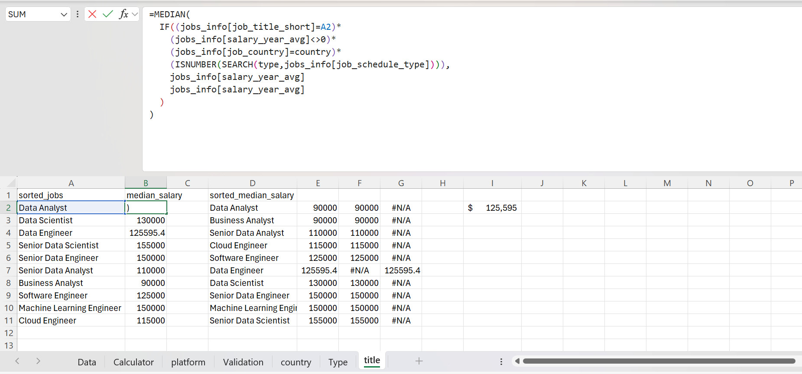
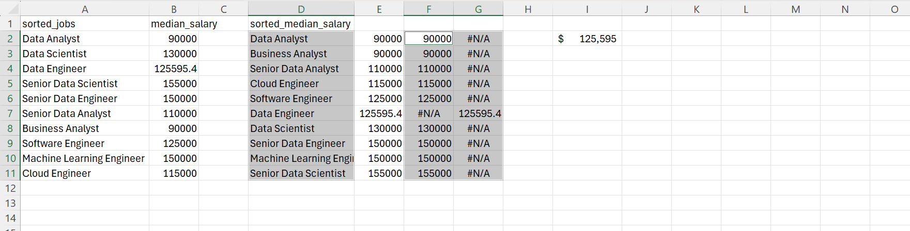

# 📊 Project 1: Interactive Excel Dashboard

### 🎥 Demo
Check out the demo GIF showing the dashboard's interactivity!



This project is an interactive Excel dashboard that dynamically updates data based on user selections. Key features include:

- **Dynamic Dropdowns:** Built with validation sheets ensuring interdependent dropdowns (country, title, type).
- **Conditional Formatting:** Highlights selected items with a darker color for clarity.
- **Advanced Formulas:**
  - Dynamic median calculations based on selections:
    ```excel
    =MEDIAN(
      IF(
        (jobs_info[job_country]=A2) *
        (jobs_info[salary_year_avg]<>0) *
        (jobs_info[job_title_short]=title) *
        (ISNUMBER(SEARCH(type,jobs_info[job_schedule_type]))),
        jobs_info[salary_year_avg]
      )
    )
    ```
  - Data filtering for cleaner dropdowns:
    ```excel
    =FILTER(J2#, NOT(ISNUMBER(SEARCH("and", J2#))) * (J2# <> 0))
    ```
- **Data Validation Logic:** Ensures consistent dropdown options like "Full-time", "Part-time", excluding complex terms like "Full-time and Internship".


- **Appearance:**
In order to make the selected item show up darker than the rest of the options I created 2 tables one to display the one to display the selected option and cover the rest and one that does the opposite.



## Example of chart creation:
The following columns where selected to make the item selected appear darker than the rest



## 🧠 Key Skills Demonstrated
- Advanced Excel functions and formulas
- Data cleaning and validation
- Pivot tables and cross-tab analysis
- Conditional formatting and drop-down validations
- Data visualization (charts, salary comparisons)