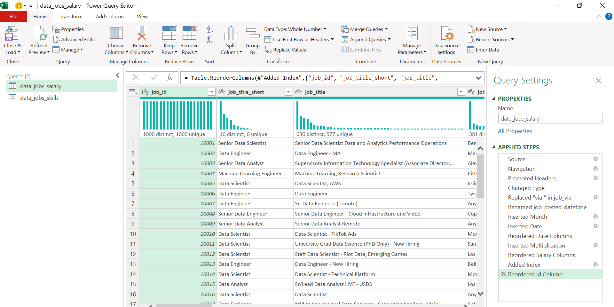
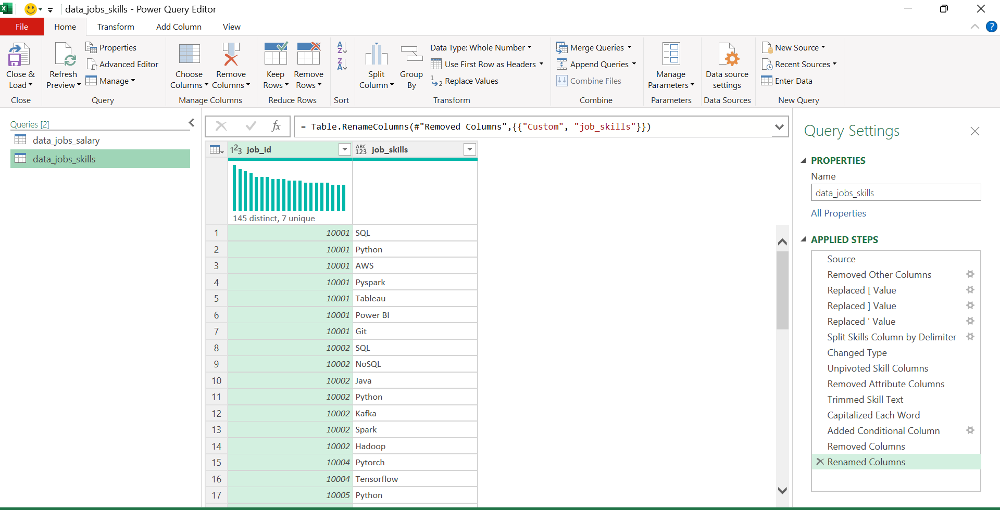
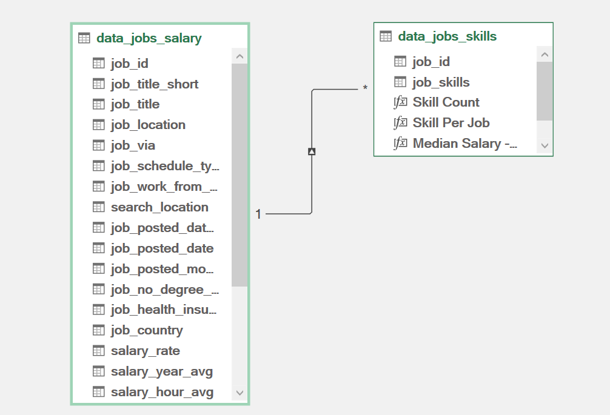
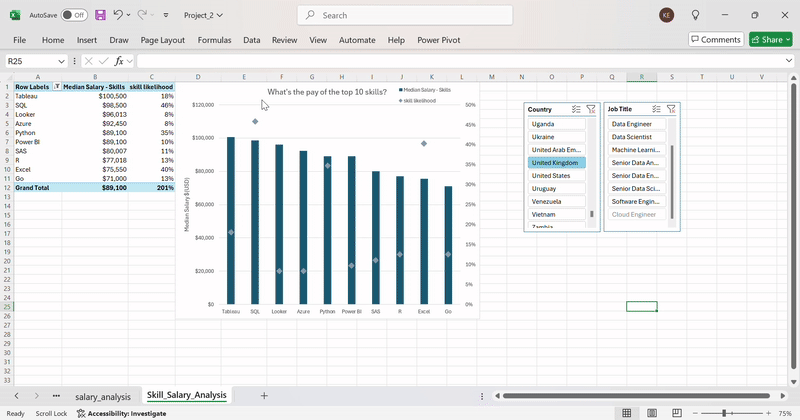

# 📈 Project 2: Power Query & Pivot Analysis

This project demonstrates my skills in **Power Query**, **Power Pivot**, and **interactive data visualization** in Excel.

Key features include:
- **Power Query Transformations:** Cleaned and prepared data with new columns, combined data, and removed inconsistencies.

Created a new skills table that combines all of the skills to be able to count the number of skills per job title

- **Data Modeling:** Created relationships between tables using diagrams.

- **Power Pivot Dashboards:** Interactive pivot charts with slicers that synchronize across sheets.

- **Slicers and Cross-Sheet Filtering:** Select a country or skill in one sheet, and the selection updates across all related sheets.

### 📊 Sheets Included:
- Skill Job Analysis
- Salary vs Skills
- Salary Analysis
- Skill Salary Analysis

### 🎥 Demo

